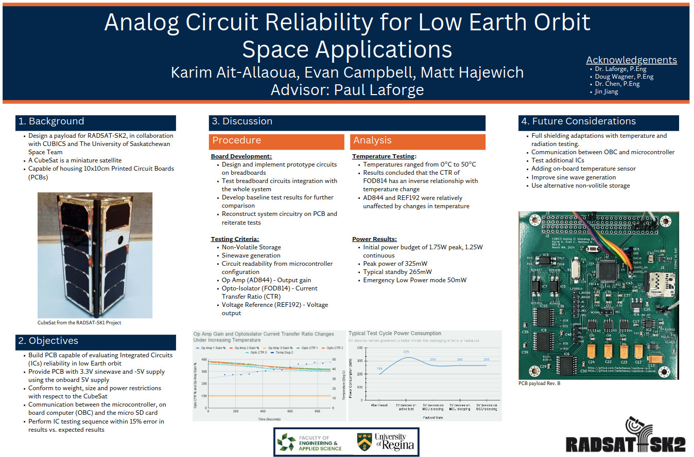
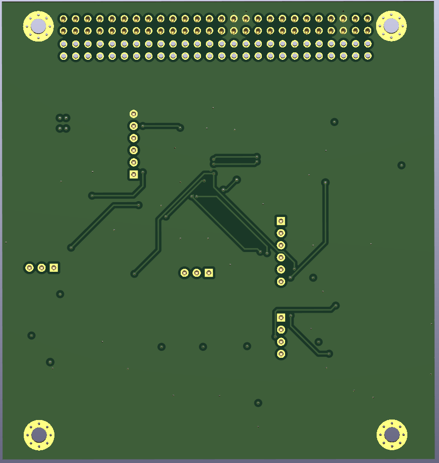
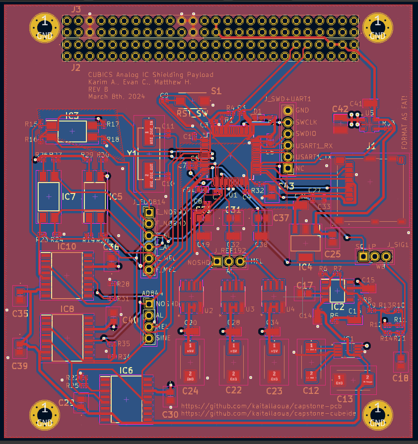

# Analog Circuit Reliability for Low Earth Orbit Space Applications

In collaboration with the University of Saskatchewan, we are contributing a payload board
for the CubeSats Initiative in Canada for STEM (CUBICS). A CubeSat is a low cost, small
and approachable design for students “to engage in an end-to-end space mission
adapted to their needs and their level of comfort, expertise and readiness” (asc-csa.
gc.ca). Our payload studies the effects of space radiation on commonly used surface
mount analog Integrated Circuits (IC’s) in Low Earth Orbit (LEO). We compare different
shielding to see which provides a better effectiveness to weight ratio.

## Setup

This project used KiCad `Version: 7.0.11-7.0.11~ubuntu22.04.1, release build` and a mix of windows builds.
Download KiCad [here](https://www.kicad.org/download/). KiCad 8 likely does work and I recommend you use it.

## Workflow

TBD (remove this once done): Someone needs to fork this repo to make further contributions to the project. Using an organization is best, I think UofS space team has one, maybe Regina team should make one? Regardless I will not be reviewing and accepting PR's to this repo.

Because using git for KiCad is like tracking binary files, I recommend to NOT rely on git handling merge conflicts. Avoid them entirely by letting only one person make changes on one branch at a time, make a PR, approve and merge and repeat and pass the baton to someone else to make changes.

## TODO

- Get I2C working (unlikely any KiCad changes)
- Get sinewave generation working 
- Add Voltage regulator
- Triple check we fit in PC104, on RADSAT-SK1 printout we dont fit in all holes, also supposed to be some notches?
- Optional: Use solder-attched external non volatile storage such as FLASH, EEPROM (or solder/glue micro sd down??)

The most substantial changes the sinwave generation. This task was assigned to Evan. Ultimately we could not get it working, thus I recommend to use a PWM wave gen from the mcu, likely add pre-amplification + current buffering, and pass it to a sharp drop off filter. The filter could be a dedicated one (probably better) or an op-amp driven one (butterworth?, wont have as good drop off without many stages).

UofRobotics is also making a PCB for their robot whose base is forked from this project, they may be a good reference for questions or idea sharing.

## Manufacturing

We used JLCPCB for `REV A` and `REV B` with great results. We also have nearly all parts ready for another revision. AT LEAST ONE MORE REVISION IS NEEDED SINCE THE FOLLOWING WERE FIXED AFTER `REV B`:

- IC1 footprint solder mask was incorrectly removed
- Micro SD card holder was facing the wrong way

Our manufacturing procedure was as follows:

Order from JLC (1 week delivery), Order from Mouser/Digikey (2-4 day delivery) -> Have all parts -> Go to ED435, use microscope, have one person assist finding parts, one pick+place, apply solder paste (min 4-5 hours)-> place in oven -> done

I recommend to use the parts list available from JLCPCB or PCBWay to assemble as much of the board for you as possible, it saves alot of time but honestly building it by hand it also not that bad. Either is fine.

## Front PCB

## Back PCB

## Front Copper Layer

